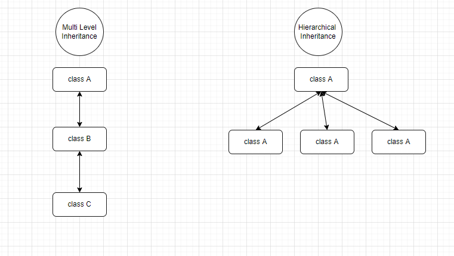

### Types of Inheritance
* Single Inheritance.
* Multilevel Inheritance.
* Hierarchical Inheritance.
* Multiple Inheritance(not supported by default).
* Hybrid Inheritance(not supported by default).

### Important Resources
* <a href="https://www.geeksforgeeks.org/inheritance-in-java/">Inheritance in Java</a>
* <a href="https://www.youtube.com/watch?v=fnqSfeZ8n8c">Type of Inheritance - video</a>
* <a href="https://www.youtube.com/watch?v=kzUUW4BSSG0">Why Java does not support Multiple Inheritance</a>

### Multilevel and Hierarchical Inheritance Demo Image.
* 

