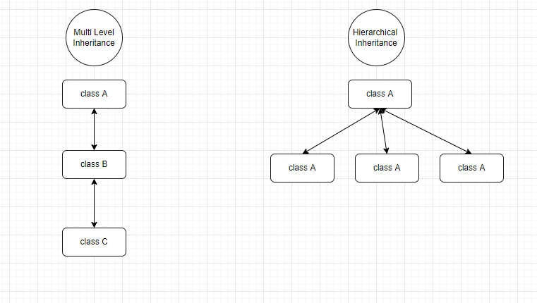

### Inheritance
* Inheritance is an important pillar of OOP(Object-Oriented Programming). 
  It is the mechanism in java by which one class is allowed to inherit the features(fields and methods) of another class.
* Important terminology:
  * **Super Class:** The class whose features are inherited is known as a superclass(or a base class or a parent class).
  * **Sub Class:** The class that inherits the other class is known as a subclass(or a derived class, extended class, or 
    child class). The subclass can add its own fields and methods in addition to the superclass fields and methods.
  * **Reusability:** Inheritance supports the concept of “reusability”, i.e. when we want to create a new class and there is 
    already a class that includes some of the code that we want, we can derive our new class from the existing class. By doing this, we are reusing the fields and methods of the existing class.

#### How to use inheritance in Java
* The keyword used for inheritance is **extends**.

### Types of Inheritance
* **Single Inheritance:** In single inheritance, subclasses inherit the features of one superclass..
* **Multilevel Inheritance:**  In Multilevel Inheritance, a derived class will be inheriting a base class and as well as the derived class also act as the base class to other class..
* **Hierarchical Inheritance:** In Hierarchical Inheritance, one class serves as a superclass (base class) for more than one subclass..
* **Multiple Inheritance:** In Multiple inheritances, one class can have more than one superclass and inherit features from all parent classes. Please note that Java does not support multiple inheritances with classes. In java, we can achieve multiple inheritances only through Interfaces.(not supported by default).
* **Hybrid Inheritance:** It is a mix of **two** or **more** of the above types of inheritance. Since java doesn’t support multiple inheritances with classes, hybrid inheritance is also not possible with classes. In java, we can achieve hybrid inheritance only through Interfaces.(not supported by default).

#### Multilevel and Hierarchical Inheritance Demo Image.
* 

### Important facts about inheritance in Java
* **Default superclass:** Except Object class, which has no superclass, every class has one and only one direct superclass (single inheritance). In the absence of any other explicit superclass, every class is implicitly a subclass of the Object class.
* **Superclass can only be one:** A superclass can have any number of subclasses. But a subclass can have only one superclass. This is because Java does not support multiple inheritances with classes. Although with interfaces, multiple inheritances are supported by java.
* **Inheriting Constructors:** A subclass inherits all the members (fields, methods, and nested classes) from its superclass. Constructors are not members, so they are not inherited by subclasses, but the constructor of the superclass can be invoked from the subclass.
* **Private member inheritance:** A subclass does not inherit the private members of its parent class. However, if the superclass has public or protected methods(like getters and setters) for accessing its private fields, these can also be used by the subclass.

#### Java IS-A type of Relationship.
* IS-A is a way of saying: This object is a type of that object.

#### What all can be done in a Subclass?
* In sub-classes we can inherit members as is, replace them, hide them, or supplement them with new members:
  * The inherited fields can be used directly, just like any other fields.
  * We can declare new fields in the subclass that are not in the superclass.
  * The inherited methods can be used directly as they are.
  * We can write a new instance method in the subclass that has the same signature as the one in the superclass, thus overriding it (as in the example above, toString() method is overridden).
  * We can write a new static method in the subclass that has the same signature as the one in the superclass, thus hiding it.
  * We can declare new methods in the subclass that are not in the superclass.
  * We can write a subclass constructor that invokes the constructor of the superclass, either implicitly or by using the keyword super.

### Resources.
* [Inheritance In Java - geeks for geeks](https://www.geeksforgeeks.org/inheritance-in-java/)
* [Java Inheritance - w3School](https://www.w3schools.com/java/java_inheritance.asp)