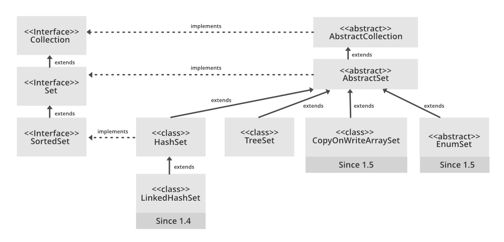

## See Day 13 Hashset for code example.

### Hashset.
* The HashSet class implements the Set interface, backed by a hash table which is actually a HashMap instance. No guarantee is made as to the iteration order of the set which means that the class does not guarantee the constant order of elements over time. This class permits the null element. The class also offers constant time performance for the basic operations like add, remove, contains, and size assuming the hash function disperses the elements properly among the buckets
* A few important features of HashSet are:
  * Implements Set Interface.
  * The underlying data structure for HashSet is Hashtable.
  * As it implements the Set Interface, duplicate values are not allowed.
  * Objects that you insert in HashSet are not guaranteed to be inserted in the same order. Objects are inserted based on their hash code.
  * NULL elements are allowed in HashSet.
  * HashSet also implements Serializable and Cloneable interfaces.
* HashSet extends **Abstract Set<E>** class and implements **Set<E>**, Cloneable, and Serializable interfaces where E is the type of elements maintained by this set. The directly known subclass of HashSet is LinkedHashSet.
* Now for the maintenance of constant time performance, iterating over HashSet requires time proportional to the sum of the HashSet instance’s size (the number of elements) plus the “capacity” of the backing HashMap instance (the number of buckets). Thus, it’s very important not to set the initial capacity too high (or the load factor too low) if iteration performance is important.
  * **Initial Capacity:** The initial capacity means the number of buckets when hashtable (HashSet internally uses hashtable data structure) is created. The number of buckets will be automatically increased if the current size gets full.
  * **Load Factor:** The load factor is a measure of how full the HashSet is allowed to get before its capacity is automatically increased. When the number of entries in the hash table exceeds the product of the load factor and the current capacity, the hash table is rehashed (that is, internal data structures are rebuilt) so that the hash table has approximately twice the number of buckets.
    * Load Factor = Number of stored elements in the table / Size of the hash table
    * If internal capacity is 16 and the load factor is 0.75 then the number of buckets will automatically get increased when the table has 12 elements in it.

#### The Hierarchy of HashSet is as follows:
* 

#### Effect on performance
*  Load factor and initial capacity are two main factors that affect the performance of HashSet operations. A load factor of 0.75 provides very effective performance with respect to time and space complexity. If we increase the load factor value more than that then memory overhead will be reduced (because it will decrease internal rebuilding operation) but, it will affect the add and search operation in the hashtable. To reduce the rehashing operation we should choose initial capacity wisely. If the initial capacity is greater than the maximum number of entries divided by the load factor, no rehash operation will ever occur.
   * **Note:** The implementation in a HashSet is not synchronized, in the sense that if multiple threads access a hash set concurrently, and at least one of the threads modifies the set, it must be synchronized externally. This is typically accomplished by synchronizing on some object that naturally encapsulates the set. If no such object exists, the set should be “wrapped” using the Collections.synchronizedSet method. This is best done at creation time, to prevent accidental unsynchronized access to the set as shown below.

#### Internal working of a Hashset.
* All the classes of Set interface are internally backed up by Map. HashSet uses **HashMap** for storing its object internally. You must be wondering that to enter a value in HashMap we need a key-value pair, but in HashSet, we are passing only one value. 

#### Storage in Hashset.
* Actually the value we insert in HashSet acts as a key to the map Object and for its value, java uses a constant variable. So in the key-value pair, all the values will be the same.

### Constructors of HashSet class
* In order to create a HashSet, we need to create an object of the HashSet class. The HashSet class consists of various constructors that allow the possible creation of the HashSet. The following are the constructors available in this class.
  * **HashSet():** This constructor is used to build an empty HashSet object in which the default initial capacity is 16 and the default load factor is 0.75. If we wish to create an empty HashSet with the name hs, then, it can be created as:
    * Syntax : HashSet<E> hs = new HashSet<E>();
   
  * **HashSet(int initialCapacity):** This constructor is used to build an empty HashSet object in which the initialCapacity is specified at the time of object creation. Here, the default loadFactor remains 0.75.
    * Syntax : HashSet<E> hs = new HashSet<E>(int initialCapacity);

  * **HashSet(int initialCapacity, float loadFactor):** This constructor is used to build an empty HashSet object in which the initialCapacity and loadFactor are specified at the time of object creation.
    * Syntax : HashSet<E> hs = new HashSet<E>(int initialCapacity, float loadFactor);

  * **HashSet(Collection):** This constructor is used to build a HashSet object containing all the elements from the given collection. In short, this constructor is used when any conversion is needed from any Collection object to the HashSet object. If we wish to create a HashSet with the name hs, it can be created as:
    * Syntax : HashSet<E> hs = new HashSet<E>(Collection C);

### Resources.
* [Hashset In Java and all Hashset methods - geeks for geeks - important](https://www.geeksforgeeks.org/hashset-in-java/)
* [Hashset in Java - w3Schools](https://www.w3schools.com/java/java_hashset.asp)
* [Set In Java](https://www.geeksforgeeks.org/set-in-java/)